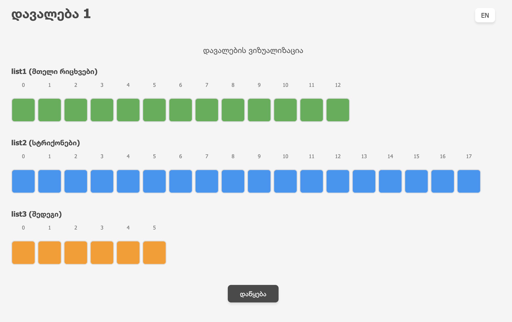

# Task 1 – Java List Filtering Simulation

📁 **Package:** `oop.mid2.t1`  
🎓 **Project:** OOP Midterm Assignment  
🧑‍💻 **Author:** Aleksi Naskidashvili  
🔗 **Animation Reference:** [max.ge Animation](https://max.ge/oop_mid2/t1/t1_aleksi_naskidashvili_1_27394816.html)

---

## 📋 Description

This Java program replicates the behavior demonstrated in the interactive animation at `max.ge`. It demonstrates:

1. How to generate a new list (`list3`) from:
    - A list of integers (`list1`)
    - A list of strings (`list2`)
      using the formula `index = 2 * n - 1`.

2. How to filter this list dynamically by **removing** elements:
    - First, the element at index `0`
    - Then, from the updated list, the element at index `1`
    - Then, from the next updated list, the element at index `2`
    - This continues until the index exceeds the list size

The result is a filtered version of `list3` that simulates the same steps visually shown in the animation.

---

## 📷 Screenshot

Below is a screenshot of the animation showing at least one value from the dataset:

> 📎 _Attach a screenshot image named_ `animation_screenshot.png` _here in the same folder._



---

## 🧪 Example Output

With:
```java
list1 = [5, 8, 4, 4, 6, 4, 6, 7, 9, 4, 8, 2, 5]
list2 = [
 "zQQkZ", "IdFs", "2KSkd", "Rnt", "R35bT", "s2IZh", "TByz4",
 "1FBrI", "4qkAV", "QfM", "dwIz", "2dN", "4OZm", "WYWg",
 "KhDcs", "FfF", "cD6D", "xGbN"
]
```
First we get list3 with following values:

```java
[FfF, 1FBrI, 1FBrI, 2dN, 1FBrI, 2dN, WYWg, xGbN, 1FBrI, FfF, Rnt, QfM, FfF]
```

And after performing the rest of actions and removing necessary values we finally get new list3: 
```java
[1FBrI, 1FBrI, WYWg, 1FBrI, Rnt]
```
